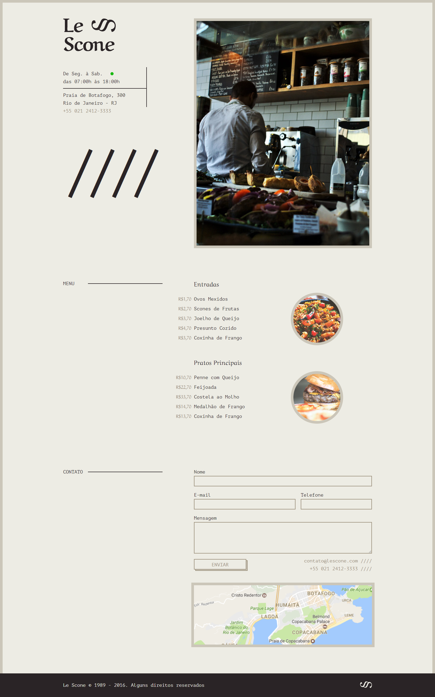

<div align='center'>


<br>
<br>

<div marginTop='10px'>
    
    
    
    
    
</div>

</div>

</br>

<h2>🔖 Descrição</h2>
<p>☕ Criação do LeScone, site criado no curso de SASS da Origamid.</p>


</br>

<h2>🚀 Tecnologias</h2>
<ul>
    <li><a href="https://sass-lang.com/" target="_blank">Sass</a></li>
    <li><a href="https://gulpjs.com/" target="_blank">Gulp</a></li>
</ul>

<br>

<h2>ℹ️ Como utilizar</h2>

Clone esse repositório

```git clone https://github.com/rafaasimi/LeScone_Origamid.git```

Navegue até a pasta

```cd LeScone_Origamid```

Abra o projeto

```index.html```

<hr>
Opcional

Caso queira utilizar o Gulp para compilar os arquivos ".scss":

Instale as dependências do Gulp

```npm install```

Monitore e compile qualquer mudança

```gulp```


<br>

<h2>🖼 Layout</h2>


<br>

<h2>📝 Licença</h2>

<p>O projeto se encontra sob licença MIT. Para mais detalhes, acesse <a href="LICENSE">license</a>.</p>
<p>
Criado com 💙 por <a href="https://github.com/rafaasimi/" target="_blank">Rafael Simionato</a></p>